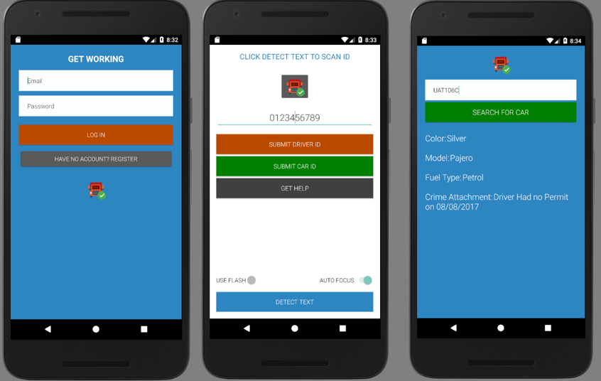

# Traffic-Assistant-Application
Traffic Assistant application (TAP) is an android mobile application that employs OCR technology to extract a car’s number plate or the license number from the one's driving permit. These details are looked up in an online MYSQL database to determine the driver or car's criminal history.

Youtube: https://youtu.be/J4nKUzhzoqM
